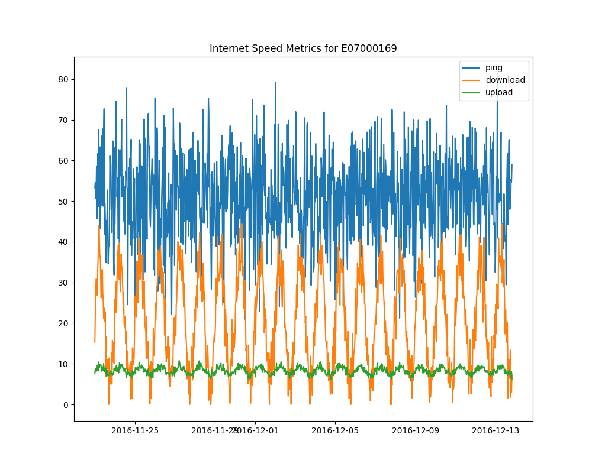
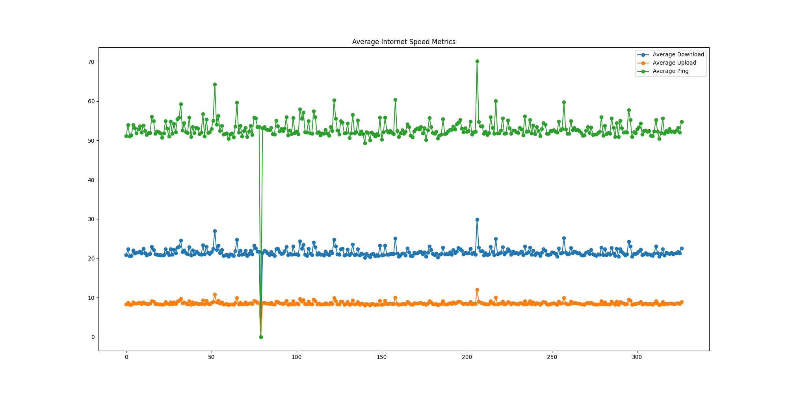

# Анализ скорости интернета

## Описание
Этот проект предназначен для анализа скорости интернета на основе данных, собранных из различных районов. Программа использует базу данных SQLite для извлечения данных, проводит их анализ и визуализирует результаты. Цель проекта - предоставить статистический анализ скорости интернета по различным параметрам: пингу, скорости загрузки и скорости выгрузки.

## Функционал
- Извлечение данных из базы данных SQLite.
- Анализ средних значений пинга, скорости загрузки и выгрузки по районам.
- Визуализация данных анализа скорости интернета.
- Создание и обновление таблицы в базе данных с результатами анализа.
- Сохранение визуализаций в виде изображений.

## Зависимости
Для работы программы необходимы следующие библиотеки:
- `sqlite3`
- `pandas`
- `matplotlib`

## Установка и запуск проекта
1. Клонируйте репозиторий:
```
git clone https://github.com/Sogato/BDA-lab3.git
```
2. Создайте виртуальное окружение:
```
python -m venv env
```
3. Установите зависимости проекта:
```
pip install -r requirements.txt
```
4. Запустите программу:
```
python main.py
```

## Пример использования
После запуска программы вы увидите в консоли статистический анализ скорости интернета, а также в директории проекта будут сохранены следующие файлы:
- `metrics_plot.png` — график, показывающий изменение пинга, скорости загрузки и выгрузки во времени для выбранного района.
- `average_metrics_plot.png` — график средних значений скорости интернета по всем районам.

## Визуализация результатов

В процессе анализа были созданы визуализации, демонстрирующие различные аспекты скорости интернета. Ниже представлены примеры графиков, полученных в результате:

### Изменение скорости интернета во времени


Этот график показывает, как менялась скорость интернета (пинг, загрузка, выгрузка) во времени для конкретного района.

### Средние значения скорости интернета


На этом графике изображены средние значения пинга, скорости загрузки и выгрузки интернета по различным районам.

---

Подготовлено в рамках учебного проекта. Все данные взяты из открытых источников и использованы исключительно в образовательных целях.

---

## Контрольные вопросы

### 1. Что такое csvsql, как она работает?
`csvsql` является инструментом из набора утилит `csvkit`, который позволяет выполнять SQL-запросы непосредственно на CSV-файлах. Это означает, что пользователи могут использовать SQL-запросы для анализа и манипулирования данными в CSV-формате без необходимости загружать данные в базу данных. csvsql преобразует CSV-файл в временную таблицу в памяти или на диске, что позволяет выполнять SQL-запросы, как если бы данные находились в реляционной базе данных.

### 2. Можно ли объединить таблицы в базе данных, как это сделать?
Да, можно объединить таблицы в базе данных, и это обычная практика для выполнения различных задач анализа данных и отчетности. Объединение таблиц обычно выполняется с помощью оператора JOIN в SQL-запросах. JOIN позволяет объединять строки из двух или более таблиц, основываясь на общем столбце между ними, что позволяет создавать связи между различными наборами данных.

#### Типы JOIN:
- **INNER JOIN**: Возвращает строки, когда есть хотя бы одно совпадение в обеих таблицах.
- **LEFT JOIN** (или **LEFT OUTER JOIN**): Возвращает все строки из левой таблицы и совпадающие строки из правой таблицы. Если нет совпадения, результат будет содержать NULL на месте столбцов правой таблицы.
- **RIGHT JOIN** (или **RIGHT OUTER JOIN**): Возвращает все строки из правой таблицы и совпадающие строки из левой таблицы. Если нет совпадения, результат будет содержать NULL на месте столбцов левой таблицы.
- **FULL JOIN** (или **FULL OUTER JOIN**): Возвращает строки, когда есть хотя бы одно совпадение в любой из таблиц. Если нет совпадения, то результат будет содержать NULL на месте столбцов другой таблицы.

### 3. Какой метод Pandas позволяет добавлять информацию в базу данных?
Метод `to_sql` из библиотеки Pandas позволяет добавлять информацию в базу данных из объекта DataFrame. Этот метод делает возможным сохранение данных DataFrame в таблицу SQL, создавая таблицу, если она не существует, или добавляя данные в существующую таблицу.

### 4. Что делает метод fetchall()?
Метод `fetchall()` используется в работе с базами данных в Python, особенно при взаимодействии с базами данных через библиотеки, такие как SQLite3 или psycopg2 для PostgreSQL. Этот метод применяется после выполнения SQL-запроса с помощью объекта курсора для извлечения всех оставшихся строк результата запроса.

При выполнении SQL-запрос для выборки данных (SELECT), база данных возвращает результаты, которые могут быть извлечены с помощью курсора. `fetchall()` собирает все эти строки в виде списка кортежей, где каждый кортеж представляет одну строку из результата запроса.

### 5. Почему для обработки данных используется библиотека Pandas, можно ли выполнить такую же обработку другим способом?
Библиотека Pandas используется для обработки данных из-за её мощных инструментов для анализа и манипуляции данными, удобства работы с табличными данными, поддержки различных форматов ввода/вывода (CSV, Excel, SQL и др.), а также эффективной обработки больших объемов данных благодаря внутреннему использованию оптимизированных библиотек, таких как NumPy.

Да, выполнить такую же обработку данных можно и другими способами, используя различные инструменты и библиотеки, например, с помощью чистого Python (что может быть менее эффективно по скорости и требовать большего количества кода), SQL для работы с базами данных, библиотеки NumPy для численных операций, а также специализированные инструменты для обработки данных, такие как Apache Spark для больших распределенных данных.
